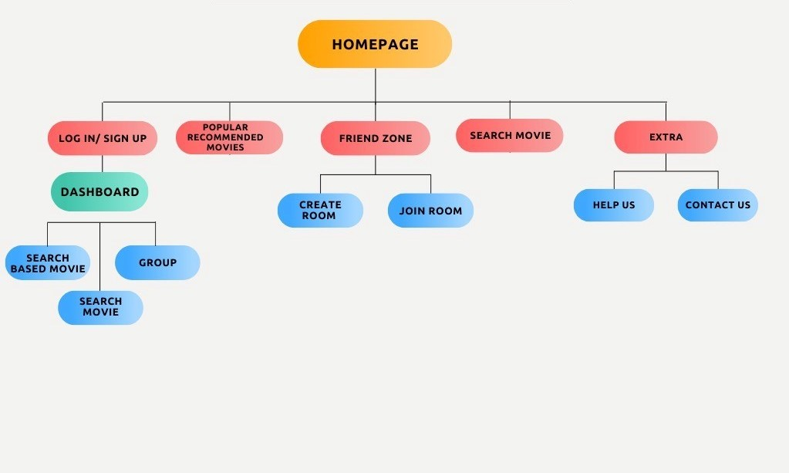
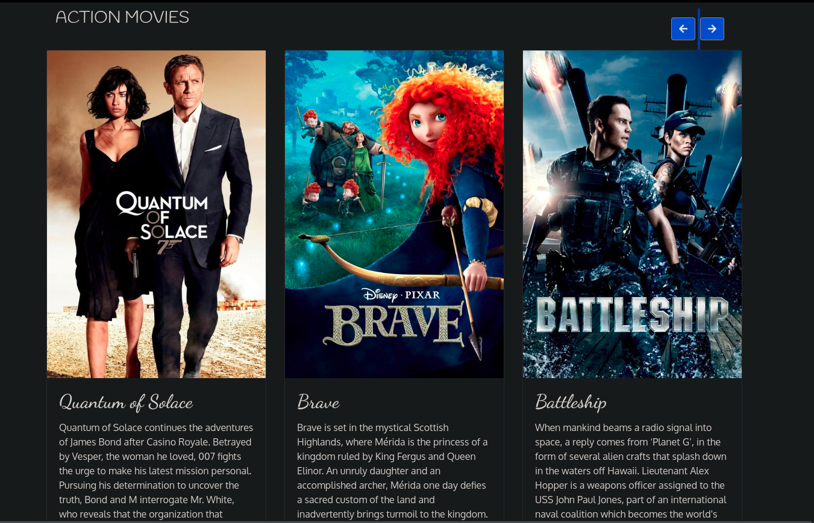
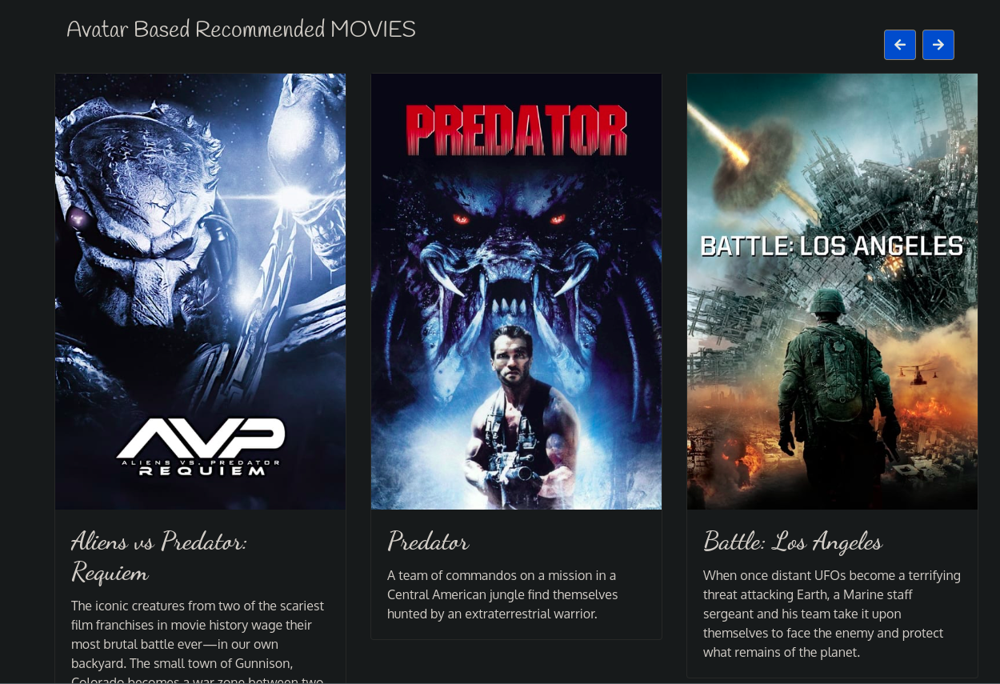
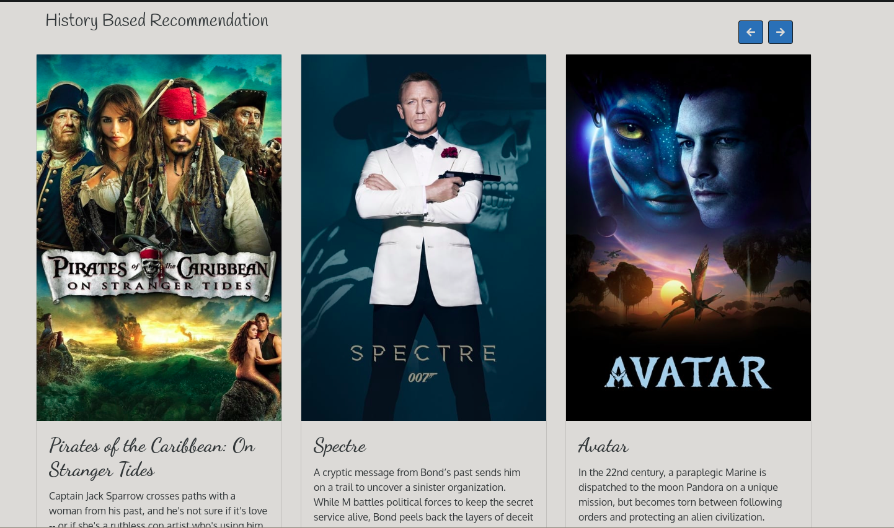

# **Movie_house**

Movie_house is a web development project. It is designed and developed by Himanshi Sharma,Ankit Gupta. It is a project related to movie recommendation. Movie is recommended on the basis of search history and it also recommends 6 other movies which are of the same genre as of the one we had searched. Additional feature is that two or more people can create room together and can enjoy the movie together.

# To start the app
- Run data.py file(python3)
- npm install
- node index

## Table of Contents:

- Features
- Technology Stack
- Workflow $ Database
- Future Plans
- Limitations
- Troubleshooting
- Images
- Credits

# Features:
1. **Search Movie** : Option is provided to Search movie in the website which return 6 related movies including searched one
2. **Search Based Recommendation** : It recommends related moive to the login user according to his/her search history
4. **Popularity based Action Movie Recommendation** : Recommends action movie to the user on the basis of the popularity of the movie
4. **Popularity based Thriller Movie Recommendation** : Recommends thriller movie to the user on the basis of the popularity of the movie
4. **Popularity based Adventure Movie Recommendation** : Recommends adventurous movie to the user on the basis of the popularity of the movie
5. **Create Meets** : User can create room in which two or more member can come together and watch movie and can chat simultaneously
5. **Video Conversation** : 2+ people can have a video conversation in this website about moive or something
6. **Turn off / on Camera** : Users are given the option to either turn on or off their webcam during call
6. **Mute / Unmute Audio** : Users are given the option to either turn on or off their mic during call
7. **Mute All Member** : A user can mute other users in the call to avoid unwanted sound
8. **Name on Hovering** : While hovering on a video box one can see the Member name
20. **Chat** : While watching the movie , users can chat simultaneously
11. **Sign Up / Log In** : If user watch moives regularly and hosts regular room and want to store the chats, list of created room and quickly remind people of the room then they can log in
52. **Reminders** : Server automatically remind users about their room at the time of their room
22. **Contact Us** : User can contact us and give feedback which will help me 
23. **Help Page** : A help page is provided where every question regarding the use of the website is provided
25. **Create Groups / Join Groups** : User can create many groups, each with a key to keep the group private and secure from unwanted people
24. **Group Details in Group Dashboard** : In the dashboard, one can see the details such as key and members so that if one forgets the key, they can find it there and also know who all are a part of the group
20. **Sound Alerts** : This is provided so that the people in the call become aware of the entering of a new person

# Technology Stack:
1. **Node.js** - Back End
2. **Python** - Recommendation system
2. **MongoDB (Mongoose)** - Database
3. **Bcrypt** - Hash Passwords
4. **Express-session** - To manage sessions
5. **EJS** - Templating
6. **CSS** - Designing (also used Bootstrap's framework and AOS' library to design)
5. **JavaScript** - For interactivity (also used jQuery)
5. **Socket.io** - For real time communication
8. **Peer.js** - Simplifies WebRTC's use
8. **Nodemailer** - Sending Reminder Mails
8. **Node-cron** - Scheduling Reminders
9. **Pickle** - For creating Model file

# Workflow

# Challenges
- **Cold-start Problem** : Recommendation for new user and new movies was a problem for me. So for new user I recommended most popular movie and new movie are recommend to user according to genres and keyword
- **Integration of Python and Nodejs** : using "require("child_process").spawn" I got rid of this

# **Future**
**Recommend similar choice user** :- Recommendation of user those who watch moive of similar genres and keyword.
- I plan to add genres and keyword of all the searched movie 
- convert whole thing in vector using countVectorizer
- store distance of one user with all other user in matrix using cosine_similarity
- Then recommend most similar user

## Images :
<h4>Home page</h4>

<h4>Search<h4>

<h4>Signup<h4>

  
<h4>Dashboard<h4>

## Troubleshooting:
- If you are not able to see the other user then try checking your connection and try using mobile data
- If you are not able to connect with the other user - go to inspect -> settings -> untick "Enable Java Script Source Maps"

## Credits:
- Developer -
 - [Himanshi Sharma](https://github.com/Himanshi2511)
 - [Shashank singh](https://github.com/singhshashank25)
 - [Ankit Gupta](https://github.com/en1gm479)
 

